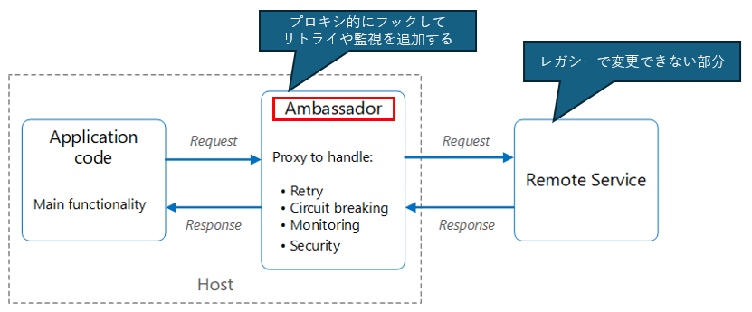
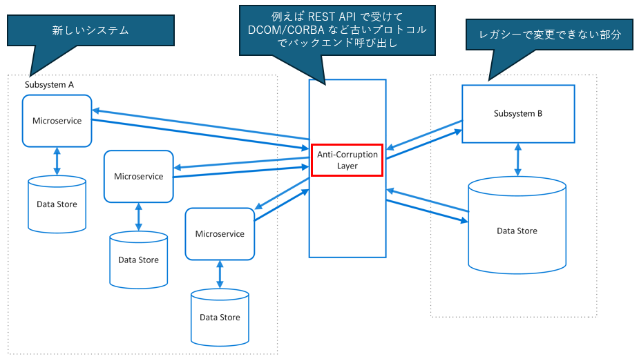
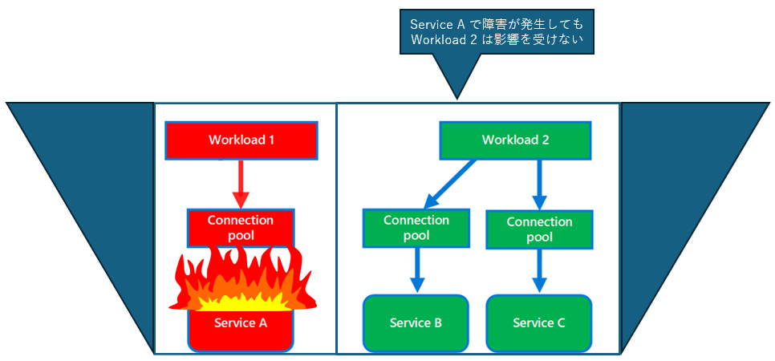
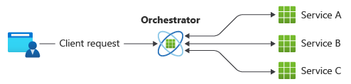
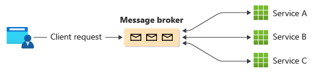

# Cloud Design Patterns

## 概要
[Azure アーキテクチャ センター](https://learn.microsoft.com/ja-jp/azure/architecture/)：[クラウド設計パターン](https://learn.microsoft.com/ja-jp/azure/architecture/patterns/#catalog-of-patterns) の中から、パターン名からは直感的に想像しにくい設計パターンについて補足します

## [アンバサダー (Ambassador)](https://learn.microsoft.com/ja-jp/azure/architecture/patterns/ambassador)
　Ambassador は、**特使、大使** といった意味の単語だが、単語の意味からは設計パターンが想像しにくい。アンバサダーパターンは、レガシーアプリケーションや変更が困難なアプリケーションに対して、プロキシー的に配置する事でリトライや監視などレジリエントな機能を追加する設計である

||
|-|

- アンバサダーにオフロードされる機能は、アプリケーションとは別に管理でき、アプリケーションの従来の機能を妨げることなく更新が可能
- サイドカーとしてデプロイすることができ、デーモンまたは Windows サービスとしてもデプロイ可能
- 注意事項として、プロキシは待機時間のオーバーヘッドをもたらす可能性があり、クライアント・アプリケーションが変更出来るのであれば**クライアント側に直接実装する**方が適切な場合もある

## [破損対策レイヤー (Anti-corruption Layer)](https://learn.microsoft.com/ja-jp/azure/architecture/patterns/anti-corruption-layer)
　レガシーシステムの段階的な移行や、外部システムとの相互運用が必要な場合に用いられる設計パターンです。**破損対策レイヤー** を設ける事で、新しいシステムが古いインフラストラクチャやプロトコルに依存せずに済みます

||
|-|

- 新旧システム間の統合を維持し続けることができ、移行の途中で発生する問題を最小限に抑え、レガシシステムの機能を段階的に新しいシステムに移行する際の柔軟性を高める

## [バルクヘッド (Bulkhead)](https://learn.microsoft.com/ja-jp/azure/architecture/patterns/bulkhead)
　Bulkhead は、**船体の区画 (bulkhead: 隔壁)** になぞらえたパターン名で、一部区画が浸水しても船が沈まないのと同じで、アプリケーションの要素をプールに分離し、1 つの要素が失敗しても、他の要素に影響を与えないようにする設計パターン

||
|-|

- 障害個所を特定しやすくなる半面、リソースの分割により全体のリソース利用効率が低下する可能性がある
- マイクロサービスアーキテクチャとの親和性が高く、Kubernetes などのコンテナ技術を使用することが推奨される

## [コレオグラフィ (choreography)](https://learn.microsoft.com/ja-jp/azure/architecture/patterns/choreography)
　Choreography は、**ダンスの振付や構成** といった意味を持つ単語。オーケストレーターパターンが、中央のオーケストレーターにより全体のワークフローを管理するのに対し、コレオグラフィパターンは、中央の**オーケストレーターなし**に各サービスが独立してワークフローを管理しますする。

**オーケストレーター**：ワークフローを管理するオーケストレーター（全体のフローを管理するプログラム）を中央に配置する

||
|-|

- サービス間の依存関係（例えば実行順序等）が必要な場合には、オーケストレーターが適している

**コレオグラフィ**：中央に Service Bus 等のメッセージ ブローカーを配置することで、各サービス側で独立してワークフローを管理する

||
|-|

- 独立したビジネス操作が並列で処理されるシンプルなワークフローに適している
- メッセージブローカーを使用することで、システムのスケーラビリティが向上し、サービス間の結合度を低く保つことができる
- メッセージのバッファリングや再試行機能により、システムの信頼性と耐障害性も向上する